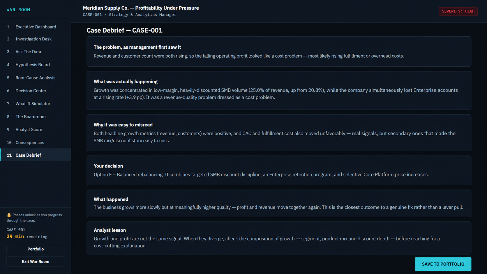
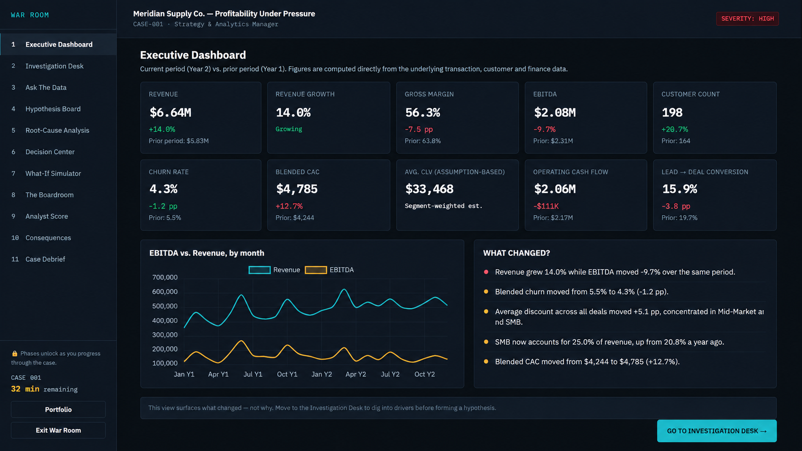
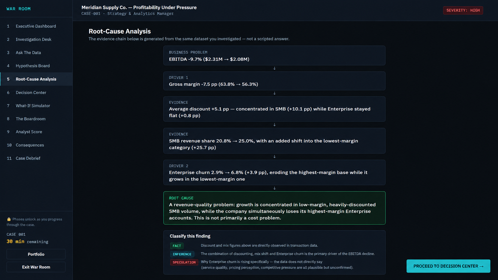
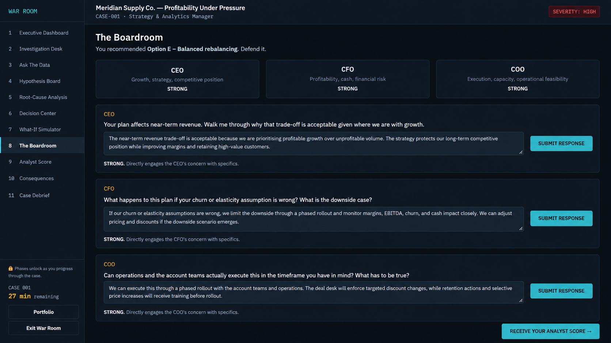

# WAR ROOM

**Data. Diagnosis. Decision. Consequence.**

> **[▶ Play WAR ROOM](https://raugan.github.io/war-room/)**

WAR ROOM is an interactive business decision intelligence simulator where you play a **Strategy & Analytics Manager** investigating a company in crisis.

Revenue and customers are growing — but profit is falling.

Your job is to investigate the evidence, test competing hypotheses, identify the root cause, make a strategic decision, defend it in front of the CEO/CFO/COO, and experience the simulated consequences.

**This isn't a dashboard with a game bolted on.**

It's a decision-making loop:

Signal → Investigation → Diagnosis → Decision → Defense → Consequence → Learning
## Preview

### Case Brief

### Executive Dashboard

### Investigation & Decision

### The Boardroom

## Architecture

WAR ROOM is built around a deterministic synthetic-data and analytics pipeline.

 

## Skills Demonstrated

* Business intelligence and KPI analysis
* Data-driven problem solving
* Hypothesis-driven investigation
* Financial and profitability analysis
* Customer segmentation and retention analysis
* Pricing and discount analysis
* Marketing CAC analysis
* Scenario and what-if modeling
* Interactive data visualisation
* Synthetic dataset generation
* State-driven frontend architecture
* Decision-support UX
* Strategic communication and executive decision-making
